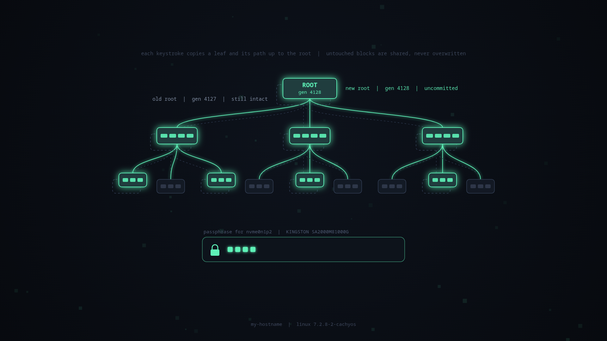

# btrfs-cow

A Plymouth theme for the LUKS passphrase prompt. Every keystroke copies a leaf
block and its path up to a new root, the way btrfs writes. A wrong passphrase
aborts the transaction; the right one commits it and hands off to the session.



`mockup/index.html` is the browser prototype the theme was ported from.

## Use

```sh
make            # render images, build build/btrfs-cow and a preview copy
make preview    # try it in an X11 window (sudo; nothing is left installed)
make install    # theme + mkinitcpio hook, not yet the default
make enable     # make it the boot theme and rebuild the initramfs
make disable    # back to owl-multihead (or PREVIOUS=name) and rebuild
```

`ACCENT=#rrggbb make` changes the accent colour.

## How it fits together

- `tools/gen-assets.html` draws every image with the mockup's code;
  `tools/build.py` renders it in headless Chrome.
- `theme/btrfs-cow.script` is the Plymouth script. Boot events drive it:
  each keystroke arrives as a password redraw, Enter as `display_normal`, and a
  successful unlock as `root_mounted` (from `plymouth-switch-root.service`).
  A second prompt with the same text means the passphrase was wrong.
- `initcpio/btrfs-cow-theme` is a mkinitcpio hook that writes the hostname,
  kernel version, root subvolume and LUKS disk names into the copy of the
  script inside each initramfs. It runs after the `plymouth` hook and only
  when btrfs-cow is the default theme.
- systemd names the disk in its prompt by GPT partition label (often just
  "root"). The theme looks up the `luks-<uuid>` volume name from the prompt
  instead and shows the device and drive model, e.g.
  "passphrase for nvme0n1p2 | KINGSTON SA2000M81000G".
- The script re-lays itself out when displays change. At boot Plymouth can
  start before the real GPU driver (e.g. nvidia-drm) takes over the display.

## If it ever breaks at boot

Edit the Limine entry and remove `splash`: you get the plain text passphrase
prompt. Esc also toggles Plymouth to its text view, which should show the
prompt as text at boot (untested here). In `make preview` that view has no
text console, so the window just goes blank; press Esc again to come back.
